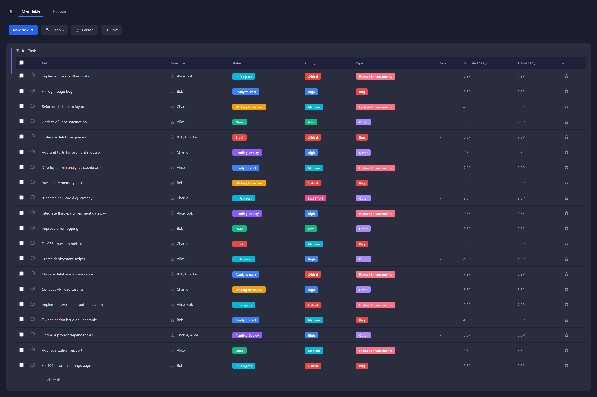

# Technical Test - Frontend Developer

Materi
1. Integrasi API Todo List (https://mocki.io/v1/f7861fc0-9071-4034-afed-777f3b590c3c)

2. Expected Result

    a. Tampilan Tabel
       
        - New Task => menambahkan task baru di posisi paling atas
       
        - Search => mencari berdasarkan nama task
       
        - Person => filter by developer
       
        - Sort => sorting berdasarkan judul kolom yang dipilih (dapat memilih
        beberapa kolom dan tipe sort ex: asc, desc)
       
        - Tabel => isi dari tabel bersifat inline editing
       
        - Task => tipe string
       
        - Developer => dapat lebih dari 1 orang
       
        - Status => terdiri dari Ready to start, In Progress, Waiting for review,
        Pending Deploy, Done, Stuck
       
        - Priority => terdiri dari Critical, High, Medium, Low, Best Effort
       
        - Type => terdiri dari Feature Enhancements, Other, Bug
       
        - Date => tipe date dengan format “dd MMM, yyyy” dan datepicker
        ketika editing
       
        - Estimated SP dan Actual SP => tipe integer
       
        - Untuk kolom Status, Priority, dan Type, di bagian bawah terdapat
        persentase dari isi kolom tersebut. Persentase dibedakan dengan
        warna yang berbeda-beda sesuai warna dari opsi.
       
        - Warna opsi dari kolom Status, Priority, Type bebas dan bersifat unik
       
        - Semua aksi dilakukan tanpa merefresh halaman

    b. Tampilan Kanban (Bonus)

        - New Task => menampilkan modal yang berisi form Task, Developer,
        Status, Priority, Type, Date, Estimated SP, Actual SP (semua tipe
        sama dengan Tabel)
    
        - Search => mencari berdasarkan nama task (sama dengan search
        tabel)
    
        - Person => filter by developer (sama dengan search tabel)
    
        - Sort => sorting berdasarkan judul kolom yang dipilih (sama dengan
        search tabel)
    
        - Kanban => terdiri dari isi Status, Ready to start, In Progress, Waiting
        for review, Pending Deploy, Done, Stuck (data kanban sama seperti
        tabel)
    
        - Card dari task terdapat title Task, Priority, Type, Estimated SP, dan
        Developer
    
        - Setiap task dapat drag and drop antar status yang berarti berubah
        status di data tabel juga.

# Hasil ScreenShoot

 .png>) 